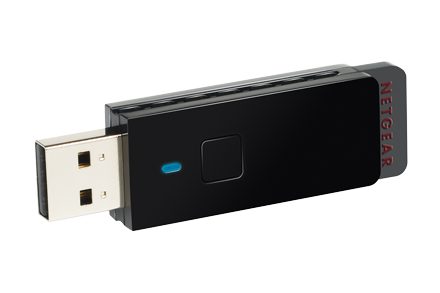

# Configuration BeagleBone Black (BBB) en gateway Wifi avec dongle USB netgear WNA 1100




## Etape 1 : Connection de l'interface wifi usb
- Vérifier que le périphérique est reconnu :
```
#root@beaglebone:~# lsusb
Bus 001 Device 002: ID 0846:9030 NetGear, Inc. WNA1100 Wireless-N 150 [Atheros AR9271]

#root@beaglebone:/home/debian# iwconfig
wlan0     IEEE 802.11bgn  Mode:Master  Tx-Power=20 dBm
          Retry short limit:7   RTS thr:off   Fragment thr:off
          Power Management:off
```
## Etape 2 : Configuration des interfaces réseaux :
- vim /etc/network/interfaces :
```
auto lo
iface lo inet loopback

auto eth0
iface usb0 inet static
    address 192.168.7.2
    netmask 255.255.255.252
    network 192.168.7.0
    gateway 192.168.7.1

iface eth0 inet static
    address 192.168.100.2
    netmask 255.255.255.0
    network 192.168.100.0
    gateway 192.168.100.1
# post-up iptables-restore < /etc/iptables.save # (1)

auto wlan0
iface wlan0 inet static
        address 192.168.4.1
        network 192.168.4.0
        netmask 255.255.255.0
        broadcast 192.168.4.255
#       hostapd /etc/hostapd/hostapd.conf
```
- Redémarrer le service réseau :
```
root@beaglebone:~# /etc/init.d/networking restart
[ ok ] Restarting networking (via systemctl): networking.service.
```

## Etape 3 : Configuration du point d'accès wifi :
- Installer le paquet hostapd :
```
apt-get install hostapd
```
- Editer le fichier /etc/default/hostapd :
```
vim /etc/default/hostapd
DAEMON_CONF="/etc/hostapd/hostapd.conf"
```
- Créer le fichier /etc/hostapd/hostapd.conf :
```
vim /etc/hostapd/hostapd.conf
```
- Ajouter les lignes suivantes en adaptant les paramètres "SSID" et "wpa_passphrase" :
```
### Wireless network name ###
interface=wlan0
#
### Set your bridge name ###
#bridge=br0

#driver
driver=nl80211

country_code=HU

ssid=NOM_SSID

channel=7

hw_mode=g

# # Static WPA2 key configuration
# #1=wpa1, 2=wpa2, 3=both
wpa=2

wpa_passphrase=your_password

## Key management algorithms ##
wpa_key_mgmt=WPA-PSK
#
## Set cipher suites (encryption algorithms) ##
## TKIP = Temporal Key Integrity Protocol
## CCMP = AES in Counter mode with CBC-MAC
wpa_pairwise=TKIP
#rsn_pairwise=CCMP
#
## Shared Key Authentication ##
auth_algs=1
## Accept all MAC address ###
macaddr_acl=0
#enables/disables broadcasting the ssid
ignore_broadcast_ssid=0
# Needed for Windows clients
eapol_key_index_workaround=0

```
## Etape 3 : Démarrer le point d'accès wifi :
- Vérifier si le process "wpa_supplicant" tourne :
```
root@beaglebone:~# ps -aux | grep wpa
root       900  0.0  0.8   5584  4288 ?        Ss   08:45   0:00 /sbin/wpa_supplicant -u -s -O /run/wpa_supplicant
```
- Si le service tourne le kill avec son numéro de process (ici 900)
```
root@beaglebone:~# kill -9 900
```
- Démarrer hostapd :
```
root@beaglebone:~# hostapd /etc/hostapd/hostapd.conf
Configuration file: /etc/hostapd/hostapd.conf
wlan0: interface state UNINITIALIZED->COUNTRY_UPDATE
Using interface wlan0 with hwaddr XX:XX:XX:XX:XX:XX and ssid "NOM_SSID"
wlan0: interface state COUNTRY_UPDATE->ENABLED
wlan0: AP-ENABLED
```


